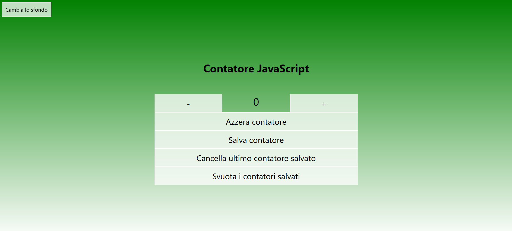

# JavaScript Counter

[](https://github.com/Sampei22/js_counter)  
[]()  
[]()  
[](https://github.com/Sampei22/js_counter/blob/main/LICENZA.txt)  
[]()

## Project Description

A simple counter built in JavaScript to practice DOM manipulation and event handling. The interface allows you to increment, decrement, reset, and save values, as well as randomly change the background.

---

## Table of Contents
- [Features](#features)  
- [Demo](#demo)  
- [Installation](#installation)  
- [Usage](#usage)  
- [Project Structure](#project-structure)  
- [Technologies Used](#technologies-used)  
- [License](#license)

---

## Features

The counter displays a numeric value that can be increased or decreased. In addition to the + and – buttons, the interface includes:

**Reset Counter** – Resets the counter value to 0.

**Save Counter** – Saves the current counter value into an array that appears below the buttons once at least one value has been stored.

**Delete Last Saved Value** – Removes the most recently saved value from the array.

**Clear All Saved Values** – Empties the array and removes all saved values.

**Change Background** – A button located in the upper-left corner randomly changes the background color when clicked.

---

## Code Example

```javascript
const coloriSfondo = [
    "linear-gradient(to top, white,green)",
    "linear-gradient(to top, white,blue)",
    "linear-gradient(to top, white,red)",
    "linear-gradient(to top, white,purple)",
    "linear-gradient(to top, white,orange)"
];

let sfondoPrecedente = 0;

btnSfondo.addEventListener("click", () => {
    let nuovoSfondo;

    do {
        nuovoSfondo = Math.floor(Math.random() * coloriSfondo.length);
    } while (nuovoSfondo === sfondoPrecedente);
    
    pointerBody.style.background = coloriSfondo[nuovoSfondo];
    sfondoPrecedente = nuovoSfondo;
});
```

We see that an array containing five different colors has been created, which then generates an integer between 0 and 4 using Math.floor(), which it uses as an array index to assign a new value to the background. Using the `do while` loop and the two variables `sfondoPrecedente` and `nuovoSfondo`, it ensures that the color doesn't repeat.

## Screenshot



## Demo

👉 [Project demo link](https://sampei22.github.io/js_counter/)

## Installation

```
git clone https://github.com/Sampei22/js_counter.git

cd js_counter

Open index.html in your browser

```

## Usage

Once you've opened the index.html file in your browser, use the buttons in the interface to:

- Increase or decrease the counter value
- Reset the counter
- Save the current value
- Remove the last saved value
- Clear the list of saved values ​​completely
- Change the background color using the appropriate button


## Project structure

*   `js_counter/`
    *   `css/` : Contains the css style file.
        * `style.css`
    *   `img/` : Contains the images used in the project.
        * `screen_counter.png`
    *   `js/` : Contains the JavaScript file.
        * `script.js`
*   `index.html` : Contains the main file.
*   `LICENSE_en.txt` : Project license documentation in English.
*   `README_en.md` : This file.
*   `LICENZA.txt` : Project license documentation in Italian.
*   `README.md` : File README in Italian.

## Technologies used

- JavaScript

- HTML5

- CSS3

## Authors

**Enrico Sanchini** - [GitHub](https://github.com/Sampei22)

## Licenza

Distributed under the Unlicense license. For more information, see the file. [LICENSE_en.txt](https://github.com/Sampei22/js_counter/blob/main/LICENSE_en.txt).


